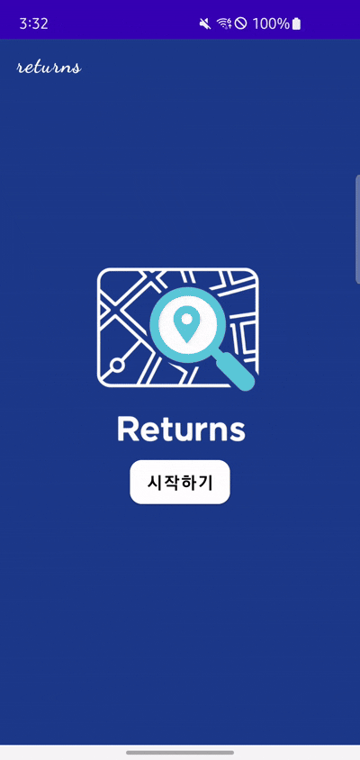
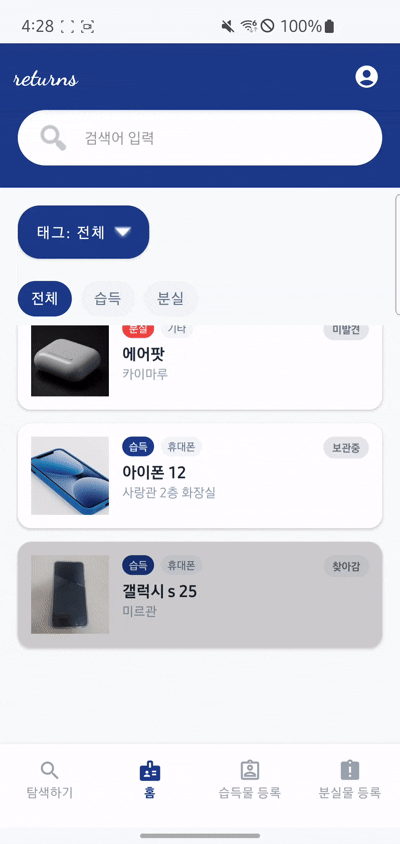
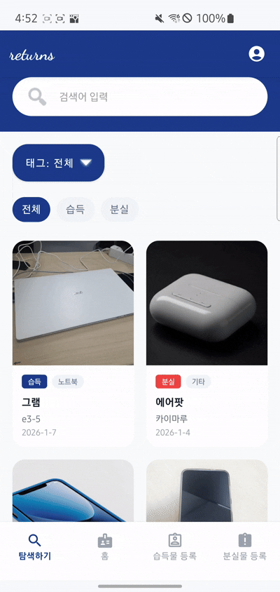
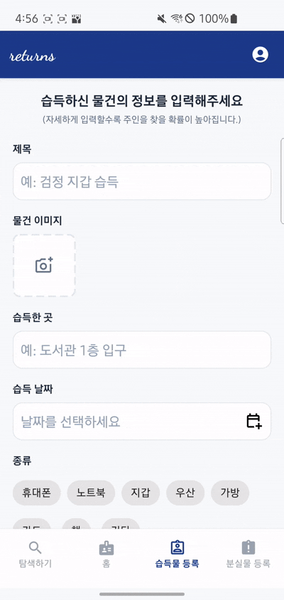

# 🔄 리턴즈 (Returns)
> 휴대폰 속 간편한 분실물 센터 앱


## 📌 프로젝트 개요

- **목표:** 누구나 쉽게 분실물을 등록하고, 습득물을 찾아갈 수 있는 직관적인 모바일 환경 제공.
- **핵심 가치:** "거래"가 아닌 "제자리로의 반환"에 집중. 상태 기반의 명확한 프로세스 제공.
- **주요 특징:** 닉네임 기반 간편 인증, 직관적인 UI/UX, 이미지 중심의 갤러리, 습득물 주인 인증 기능.

## 🧑‍💻 팀원 소개

    

## 🚀 주요 기능

### 1. 간편 접근 및 본인 인증 (Tab 0)



- **닉네임 로그인:** 별도의 회원가입 없이 닉네임(최대 8자, 중복 확인)만으로 서비스 이용 시작.
- **작성자 식별:** 닉네임을 기반으로 본인이 작성한 글에 대한 수정/관리 권한 부여.

### 2. 통합 리스트 홈 (Tab 1)



- **직관적인 목록:** 분실물(LOST)과 습득물(FOUND)을 한눈에 볼 수 있는 메인 화면.
- **강력한 탐색:**
    - **검색:** 제목 및 장소 키워드 검색 지원.
    - **필터:** 카테고리(지갑, 우산 등) 및 상태(보관중, 찾아감 등) 필터링 칩 제공.
    - **정렬:** 최신 등록순 기본 정렬.
- **상태 시각화:** 각 아이템의 상태를 직관적인 색 및 태그등으로 표시.


- **댓글:** 게시글에 댓글을 통해 습득자/분실자에게 연락 가능. 게시글 작성자는 메시지를 받으면 알림 표시

### 3. 이미지 갤러리 (Tab 2)



- **이미지 중심 탐색:** 그리드 형태로 분실/습득물 사진을 모아보는 갤러리 뷰 제공.
- **요약 정보:** 썸네일 하단에 제목과 태그 표시.

### 4. 맞춤형 등록 프로세스 (Tab 3 & 4)



- **습득물 등록 (Tab 3):** 발견 장소, 현재 보관 장소, 찾는 방법 등 습득에 특화된 폼 제공.
- **분실물 등록 (Tab 4):** 잃어버린 장소, 연락처 등 분실에 특화된 폼 제공.
- **실시간 반영:** 등록 즉시 메인 리스트에 데이터 반영.

## 🛠️ Tech Stack

- **OS:** Android (Min SDK 26+)
- **Language:** Java
- **Architecture:** MVVM (Model-View-ViewModel)
- **UI:** Jetpack Compose
- **Navigation:** Jetpack Navigation Component (BottomNavigationView 연동)

## 🗺️ UX Flow
```java
graph TD
A[앱 실행] --> B[닉네임 로그인] --> C[메인 화면 - Bottom Nav]


        %% 메인 탭 구성
D --> T1[탭 1: 홈 리스트]
D --> T2[탭 2: 이미지 갤러리]
D --> T3[탭 3: 습득물 등록]
D --> T4[탭 4: 분실물 등록]

        %% 상세 화면 이동
T1 -- 아이템 클릭 --> DETAIL[아이템 상세 화면]
T2 -- 이미지 클릭 --> DETAIL[아이템 상세 화면]

        %% 댓글 및 알림 로직
DETAIL -- 댓글 작성 --> LOGIC{본인 글인가?}
LOGIC -- No --> NOTI_DB[(알림 DB 저장)]
LOGIC -- Yes --> END((종료))

NOTI_DB --> POPUP[본인글에 댓글시 실시간 상단 팝업 노출]

        %% 알림 모달 관리
D -- 사람 아이콘 클릭 --> MODAL[알림 목록 모달]
MODAL -- [확인] 클릭 --> DELETE[DB 삭제 및 모달 새로고침]
DELETE --> MODAL

MODAL -- 알림 내용 클릭 --> DETAIL_FROM_NOTI[모달 닫고 상세 화면 이동]
DETAIL_FROM_NOTI --> DETAIL

```
